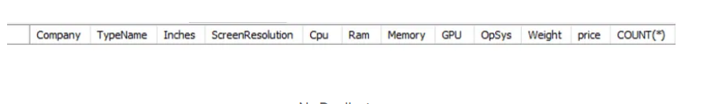

# SQL Data Cleaning Project Documentation

## Introduction

The data cleaning project was conducted using **MySQL Workbench**. The dataset used for this project can be found on Kaggle at the following link: [Unclean Laptop Price Dataset](https://www.kaggle.com/datasets/ehtishamsadiq/uncleaned-laptop-price-dataset).

[Here](Data%20Cleaning.sql) is the SQL file.

This dataset contains **1300 rows** and **12 columns**. Before beginning the cleaning process, I manually assessed the dataset to identify any inconsistencies, errors, null values, duplications, unwanted columns, irrelevant characters, and other errors that could affect the accuracy of any subsequent analysis.

## Data Cleaning Process

The data cleaning process involved several key steps to ensure the dataset was properly prepared for analysis:

1. **Create Backup:**  
   Before making any changes to the dataset, I created a backup by duplicating the original dataset. This ensures that the original data is preserved in case it is needed later.

2. **Exploratory Data Analysis (EDA):**  
   A brief EDA was conducted to understand the data structure, identify patterns, and assess the data as a whole. This step was crucial in determining the most appropriate cleaning strategies for the dataset. The EDA revealed several issues, including missing values, data inconsistencies, and unnecessary columns that needed to be addressed.

3. **Dropping Unnecessary Columns and NULL Values:**  
   After assessing the dataset, unnecessary columns that did not contribute to the analysis were removed. Additionally, rows with NULL values were dropped to ensure that the remaining data was complete and consistent.

   - **Total rows before dropping NULL values:** 
   

   - **Total rows after dropping NULL values:** 
   

4. **Handling Duplicate Values:**  
   Duplicate entries can skew the results of any analysis, however there are no duplicate records from the dataset.
   

5. **Modifying Data Types:**  
   Data types were modified to ensure that each column was correctly formatted for its intended use. For example, numerical columns were converted to the appropriate numeric types, and date columns were formatted to allow for accurate date-based analysis.

6. **Creating New Columns:**  
   New columns were created to enhance the dataset and make it more suitable for analysis. These new columns were derived from existing data and provided additional insights that were not available in the original dataset.

## Skills Demonstrated

Throughout the project, several SQL skills were demonstrated:

- **Data Definition Language (DDL):**  
  Utilized commands such as `CREATE TABLE`, `SELECT INTO`, `UPDATE`, and `INSERT INTO` to manage the structure and content of the dataset.

- **Data Query Language (DQL):**  
  Employed the `SELECT`, `FROM`, and `WHERE` clauses to retrieve and manipulate data.

- **Conditional and Filter Statements:**  
  Implemented `CASE` statements, `WHERE` filters, and `HAVING` clauses to apply conditions and refine the data selection.

- **JOINS:**  
  Used various types of joins to combine data from multiple tables, enhancing the dataset and providing a more comprehensive view of the information.

- **Aggregate Functions:**  
  Applied aggregate functions like `SUM`, `COUNT`, `AVG`, etc., to summarize and analyze the data.

- **Common Table Expressions (CTEs):**  
  Leveraged CTEs to simplify complex queries and break down the data cleaning process into more manageable steps.

## Conclusion

Data cleaning is an essential step in the data analysis process, as it ensures that the dataset is accurate, consistent, and free from errors. By carefully cleaning the dataset, I was able to eliminate potential issues that could have compromised the quality of the analysis. This project highlights the importance of data cleaning in transforming raw data into a reliable foundation for informed decision-making.
